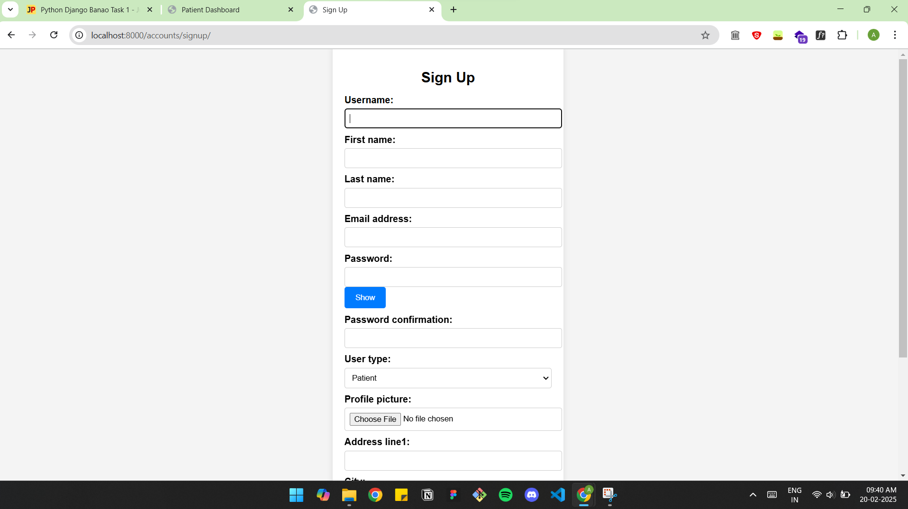
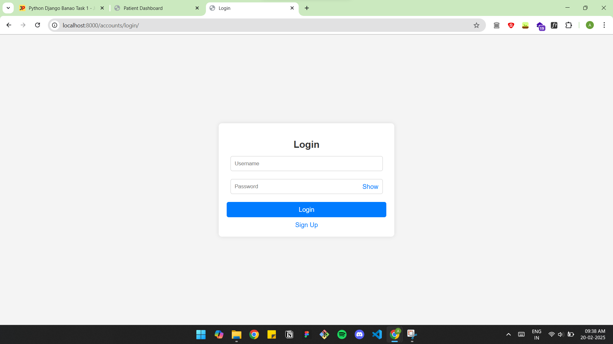
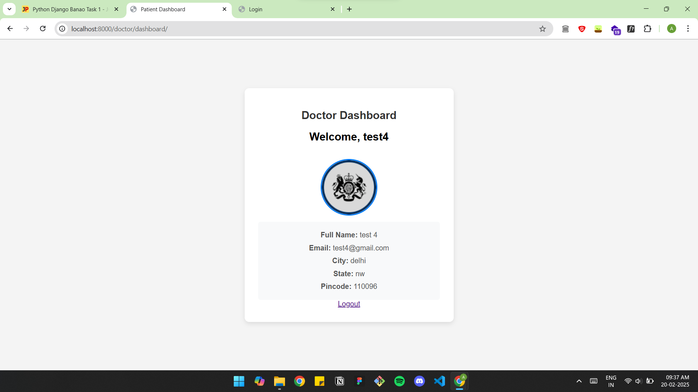
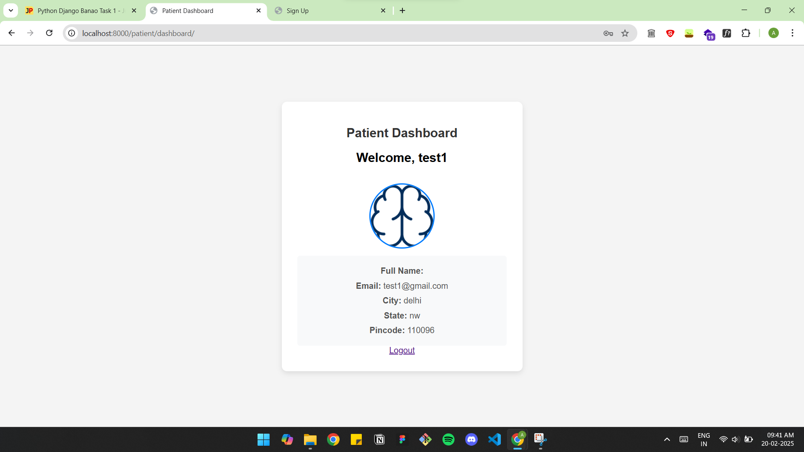

# Healthcare Management System

A Django-based healthcare management system with user authentication and role-based access for **Doctors** and **Patients**. Users can sign up, log in, and manage their profiles.

## 📌 Features
- **User Authentication**: Register, login, and logout functionality.
- **Role-Based Access**: Separate dashboards for doctors and patients.
- **Profile Management**: Users can update their personal details.
- **Secure Password Management**: Password hashing and validation.
- **Responsive Design**: Built with HTML, CSS, and Django templates.

## 🚀 Tech Stack
- **Backend**: Django (Python)
- **Frontend**: HTML, CSS (Material UI / Bootstrap can be used)
- **Database**: SQLite (default), can be switched to PostgreSQL
- **Authentication**: Django Auth
- **Deployment**: hosted on  AWS 

## 📂 Project Structure
```
/healthcare-management/
├── accounts/        # User authentication and management
├── doctor/          # Doctor-related functionalities
├── patient/         # Patient-related functionalities
├── static/          # CSS, JS, Images
├── templates/       # HTML templates
├── healthcare/      # Main Django project settings
├── db.sqlite3       # Database
├── manage.py        # Django management script
```

## 🛠 Installation
1. **Clone the repository**
   ```bash
   git clone https://github.com/ankit-o07/django-auth-banao.git
   cd healthcare-management
   ```

2. **Create a virtual environment and activate it**
   ```bash
   python -m venv venv
   source venv/bin/activate  
   ```

3. **Install dependencies**
   ```bash
   pip install -r requirements.txt
   ```

4. **Run migrations**
   ```bash
   python manage.py migrate
   ```

5. **Create a superuser** (for admin access)
   ```bash
   python manage.py createsuperuser
   ```

6. **Start the development server**
   ```bash
   python manage.py runserver
   ```

7. **Access the application**
   - Open `http://127.0.0.1:8000/` in your browser.


## 🌐 Deploying with NGINX & Gunicorn
1. **Install Gunicorn & NGINX**
   ```bash
   sudo apt update
   sudo apt install gunicorn nginx
   ```

2. **Start Gunicorn**
   ```bash
   gunicorn --workers 3 --bind unix:/run/gunicorn.sock RBAC.wsgi:application
   ```

3. **Configure NGINX**
   - Open the config file:
     ```bash
     sudo nano /etc/nginx/myproject/
     ```
   - Add the following:
     ```nginx
     server {
         listen 80;
         server_name your_domain_or_IP;

         location /static/ {
             root /home/ubuntu/project/django-auth-banao;
         }

         location / {
             proxy_pass http://unix:/run/gunicorn.sock;
             
         }
     }
     ```
   - Save and exit (Ctrl+X, then Y, then Enter)

4. **Enable the NGINX config**
   ```bash
   sudo ln -s /etc/nginx/sites-available/healthcare /etc/nginx/sites-enabled
   sudo nginx -t
   sudo systemctl restart nginx
   ```


## Screenshots

### 🏠 Signup Page


### 🔐 Login Page


### 🏥 Doctor Dashboard


### 🏥 Pateint Dashboard



## ✨ Contributing
Feel free to contribute by opening issues or submitting pull requests.

---

